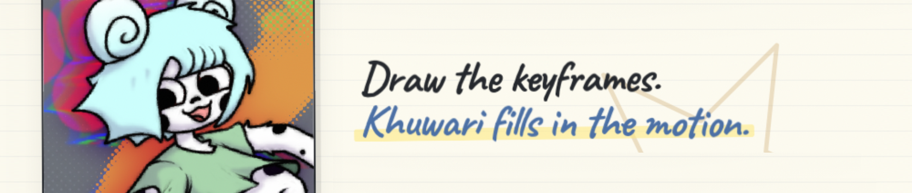

<div align="center">



<div align="center">
  &nbsp;&nbsp;
  &nbsp;&nbsp;
  &nbsp;&nbsp;
  
</div>

</div>

Khuwari is a browser based animation tool that fills in the frames between your keyframes with machine learning. You bring the art, it brings the inbetweens. Everything runs locally, so your images and projects never leave your machine.

## What you can do

- **ML inbetweens.** A machine learning model generates the frames between your keyframes, with a built-in fallback and a squash and stretch mode per gap.
- **Layer based timeline.** Backgrounds, characters and effects each live on their own layer, with their own keyframes and gaps.
- **Color fill dots.** Drop dots on a color layer and they fill the line art on the layer above, each with its own threshold, grow radius, gradient and timing.
- **Onion skinning.** See the frames around the one you are working on, as ghosts or tinted, with configurable frame counts.
- **Motion blur.** Per gap motion blur that eases in and out with the movement, to mask small glitches in the generated frames.
- **Blend modes.** 16 blend modes per keyframe.
- **Camera.** A non-destructive pan / zoom / rotation track, keyframed on its own row in the timeline and included in exports, plus per-key lens and film effects: fisheye, film grain, chromatic aberration, vignette and handheld shake.
- **Reference audio.** Load a sound file to animate to; it plays in sync with the timeline, and the file rides along inside your project file.
- **Undo / redo.** Step any edit back or forward (Ctrl/Cmd+Z, Ctrl/Cmd+Shift+Z or Ctrl/Cmd+Y), in the timeline and in the paint tool.
- **Built-in paint tool.** A Krita-style drawing workspace with layers (opacity, visibility and blend modes), onion skinning and brush stabilizers. Ships with Krita brush presets, loads more `.kpp` brushes, and paint-made library images stay editable (layers + blend modes intact).
- **Export.** PNG sequence, animated GIF or video (MP4, WebM, MKV, MOV or MPEG-TS), at the resolution you pick.
- **Local and private.** The whole tool runs in your browser. No accounts, no uploads, no tracking.

## Try it

The easiest way is to open Khuwari straight from the [website](https://theshovel.rocks/khuwari/) in your browser. No install, nothing to set up, everything runs in the tab.

You can also host it yourself. Khuwari is a static site, so any file server works:

```sh
python3 -m http.server 4000
```

Then open http://localhost:4000 to browse the site, and http://localhost:4000/editor.html for the editor itself. Load the example project from the editor's start screen and press play.

## Documentation

The website lives at [theshovel.rocks/khuwari](https://theshovel.rocks/khuwari/): the home page, the [docs hub](https://theshovel.rocks/khuwari/docs.html) with a live search across every category, each category's own [page](https://theshovel.rocks/khuwari/docs/getting-started.html) under the docs section, and the [credits page](https://theshovel.rocks/khuwari/credits.html).

## How it works

1. Add images to the asset library.
2. Drag them onto the timeline as keyframes.
3. Set how each gap behaves and let the machine generate the inbetweens.
4. Play, tweak, and export a video, GIF or frame sequence.

Projects save as single `.khuwari` files, which are plain JSON.

## Krita brushes

The paint tool auto-loads every brush in the `brushes/` folder — Krita `.kpp` presets (stroke preview, engine params, and the real brush-tip textures from `brushes/tips/` are all parsed — including `.gbr` and `.gih` GIMP brush formats) **and** MyPaint `.myb` brushes (with their `_prev.png` previews). The bundled set is Krita's own default presets, and the tool opens with Krita's default brush (“b) Basic-5 Size” — a 40px hard auto-brush with auto-spacing). Just drop files into the folder:

- **Served with `python3 -m http.server`** (recommended): the app reads the folder's directory index directly, so any brush you add is picked up automatically — no extra step.
- **Static hosts** that hide directory listings (e.g. GitHub Pages): the app falls back to `brushes/manifest.json`. Refresh it after adding brushes with `node tools/update-brush-manifest.js`.

Loading is logged to the browser console with a `[brushes]` prefix, so a failed load is never silent. Note: if you open `editor.html` straight from disk (`file://`), browsers block the folder/manifest fetch — serve the folder over HTTP instead.

## Development

The editor code lives in `src/` as plain scripts, one file per concern (state, elements, workers, timeline, generation, export, and so on). No build step: `editor.html` loads them in order, and the whole editor shares one global scope. Edit a file in `src/` and refresh the page.

Roughly ordered by dependency, so read them top to bottom: `01-header.js` opens the app and pulls in the vendor globals, `24-footer.js` starts it (`boot()`).

## Credits

Khuwari is built with RIFE and ONNX Runtime Web for machine learning inbetweens, gifenc for GIF encoding and Mediabunny for video muxing. Everything else was written for Khuwari. See the [credits page](https://theshovel.rocks/khuwari/credits.html) for the full list.

## License

Khuwari is open source under the GNU Affero General Public License v3. See [LICENSE](LICENSE).
